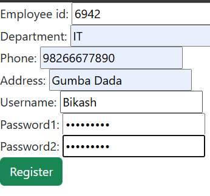
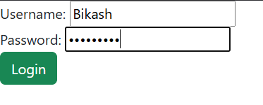
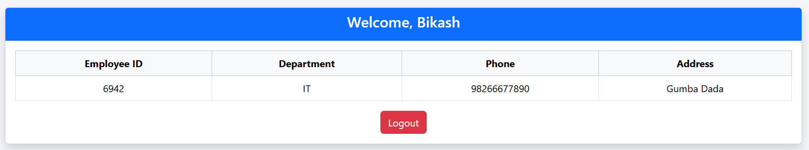

# Django Authentication Model with base model 

A simple user login , registration using the built-in authentication base model of django.

## Features
* Employee and User creation (registration) using one to one relationship with django default User.
* Secure login with session 
* Dashboard to view employee detail
* Logout 

## Project Structure

__Project Name__ = AuthModel

__App Name__ = employees

# Codes

__Model of this app__

    class Employee(models.Model):

        user=models.OneToOneField(User,on_delete=models.CASCADE)
        employee_id = models.IntegerField(unique= True)
        department = models.CharField(max_length=20)
        phone = models.CharField(max_length=15)
        address = models.CharField(max_length=20)
        
        def __str__(self):
        return self.user.username

This is a model for the employee which contains default user model from django and the User and the Empolyee are in one to one relationship.

__Model form__

    class EmployeeForms(forms.ModelForm):
        username = forms.CharField()
        password1 = forms.CharField(widget=forms.PasswordInput)
        password2 = forms.CharField(widget=forms.PasswordInput)
        class Meta:
            model = Employee
            fields = ['employee_id','department','phone','address']

        def clean(self):
        cleaned_data = super().clean()
        p1=cleaned_data.get('password1')
        p2=cleaned_data.get('password2')

        if p1 and p2 and p1 != p2:
            raise forms.ValidationError("Password doesnt match")
        return cleaned_data

        def save(self, commit = True):
            # Get form data
        cleaned_data = self.cleaned_data
        username = cleaned_data.get('username')
        password = cleaned_data.get('password1')

        # Create user
        user = User(username = username)
        user.set_password(password)
        user.save()

        # Create employee instance
        employee = super().save(commit=False)
        employee.user = user
    
        if commit:
            employee.save()
        
        return employee

This is the model form to register the user along with employee. The methods inside the Forms run itself when the form is submitted.

__Views__

    def register_view(request):
        if request.method == 'POST':
            form = EmployeeForms(request.POST)
            if form.is_valid():
                form.save()
                return redirect('login')
        else: 

            form = EmployeeForms()
        
        return render (request, 'employees/index.html',{"form":form})

    def login_view(request):
        if request.method == 'POST':
            form = AuthenticationForm(request,data=request.POST)
            if form.is_valid():
                user=form.get_user()
                login(request,user)
                return redirect('dashboard')
        else:
            form = AuthenticationForm()
        
        return render (request,'employees/login.html',{'form':form})

    @login_required
    def dashboard_view(request):
        employee = request.user.employee
        return render(request,'employees/dashboard.html',{'employee':employee})

    def logout_view(request):
        logout(request)
        return redirect('login')

Each of the views serve as the purpose in its method name.

__Urls__

    from django.urls import path
    from .import views

    urlpatterns=[
    path('register/',views.register_view,name='register'),
    path('login/',views.login_view,name='login'),
    path('dashboard/',views.dashboard_view,name='dashboard'),
    path('logout/',views.logout_view,name='logout')
    ]
The urls serve as the gateway for each of the routes and responsible for the rendering of the templates.

__Screenshots__

Registering the employee.

Logging in.

Dashboard after logging in.